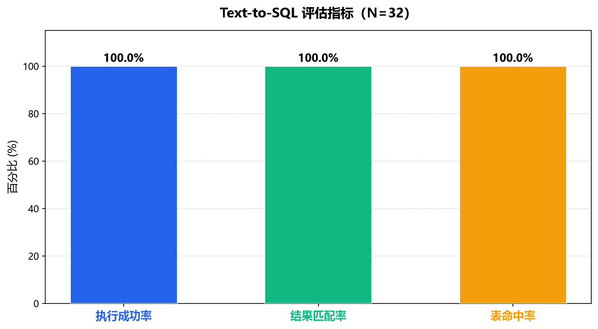
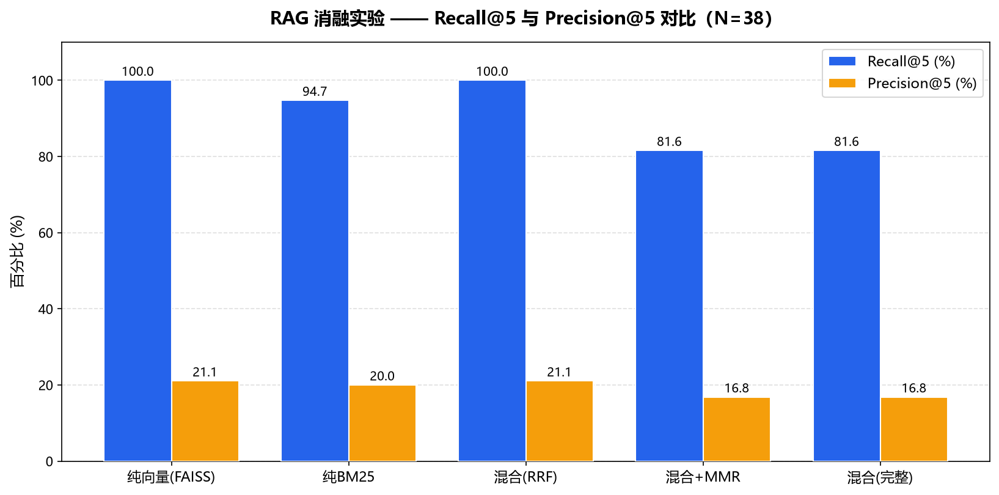
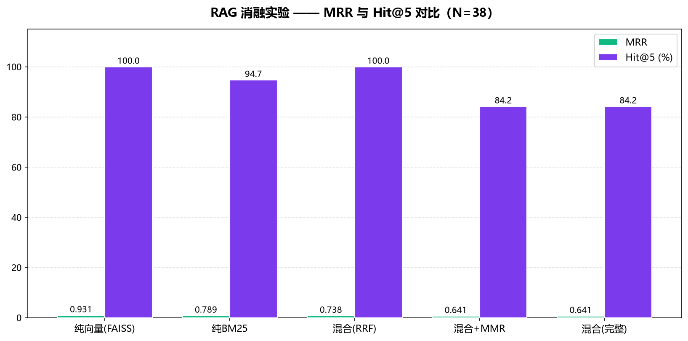

# 📊 智能金融投研助手 (FinResearch Agent)

> 基于 LangChain + 通义千问的企业级金融投研助手,采用**多 Agent 协作**架构,融合 **Text-to-SQL 结构化数据分析** 与 **RAG 非结构化文档检索** 双轮驱动,支持自然语言生成投研报告。

---

> ⚠️ **重要免责声明 — 请务必阅读**
>
> 1. **本项目仅用于学习与技术演示**,所有数据均为模拟生成,**禁止直接对接真实公开金融数据用于商用投研服务**。
> 2. **研报、公告、路演等文档版权**:模拟数据无版权风险;若使用爬虫抓取真实文档,请严格遵守目标网站 `robots.txt` 与版权协议,仅作个人学习用途,**不得传播、分发或商用**。
> 3. **所有分析结论仅供学习参考,不构成任何投资建议**。金融市场有风险,投资需谨慎。请基于专业投资顾问的指导进行投资决策。
> 4. 本项目不提供任何投资收益保证,使用本项目产生的任何盈亏均与作者无关。

---

## 📑 文档导航

| 文档 | 说明 | 适合人群 |
|------|------|---------|
| [README.md](./README.md) | 项目总览 + 快速开始 + 边界说明 | 所有人 |
| [IMPLEMENTATION_PLAN.md](./IMPLEMENTATION_PLAN.md) | 6 阶段开发计划 + 里程碑 | 开发者 |
| [架构设计文档](./docs/architecture/ARCHITECTURE.md) | 多 Agent 协作机制 + 状态流转 | 架构师 |
| [SQL 安全规范](./docs/architecture/SECURITY.md) | 注入防护 + 只读隔离 + 超时机制 | 安全工程师 |
| [RAG 调优指南](./docs/rag/RAG_TUNING.md) | 切分策略 + 重排 + TopK + 混合检索 | RAG 工程师 |
| [API 接口文档](./docs/api/API_REFERENCE.md) | FastAPI 接口 + 入参出参 + 示例 | 后端/前端 |
| [Streamlit 使用手册](./docs/api/STREAMLIT_GUIDE.md) | 看板功能分区 + 操作流程 | 产品/用户 |
| [部署运维指南](./docs/deployment/DEPLOYMENT.md) | Docker + 多机部署 + 数据库迁移 | 运维工程师 |
| [扩展开发指南](./docs/extend/EXTEND_GUIDE.md) | 新增表/文档格式/Agent/图表 | 贡献者 |
| [常见问题 FAQ](./docs/FAQ.md) | 高频报错 + 排障方案 | 所有人 |

---

## 🎯 项目定位

真实金融投研工作中,分析师需要同时处理两类信息:
- **结构化数据**:股票行情、财报指标、交易记录(SQL 数据库)
- **非结构化文档**:券商研报(PDF)、公司公告(TXT)、路演资料(PPT)

传统 BI 工具只能查数据库,纯 RAG 系统只能查文档。**本项目把两者融合**,用户用一句话即可同时调用两种能力,生成完整投研报告。

---

## ✨ 核心能力与边界

### ✅ 支持的能力

| 能力 | 实现 | 输入示例 |
|------|------|---------|
| 📈 Text-to-SQL | 自然语言→SQL→执行→数据 | "茅台近5年营收复合增长率" |
| 📄 RAG 文档检索 | 多格式加载+切分+向量检索 | "最新研报对茅台的盈利预测" |
| 🔀 混合编排 | Router Agent 自动路由 | "分析茅台财报+对比行业+引用研报" |
| 📊 自动可视化 | Plotly 智能选图(3 种) | SQL 结果→柱状图/折线图/饼图 |
| 📝 投研报告 | Markdown 渲染输出 | 完整投研分析报告 |
| 🌐 双形态接口 | FastAPI + Streamlit | API 调用 / Web 看板 |

### ❌ 不支持的能力与已知局限

#### Text-to-SQL 能力上限

| 维度 | 支持情况 | 说明 |
|------|---------|------|
| 单表查询 | ✅ 完全支持 | SELECT/WHERE/GROUP BY/ORDER BY/LIMIT |
| 多表联查(2-3 表) | ✅ 基本支持 | JOIN 需表间有明确外键关系,复杂关联可能出错 |
| 子查询 / 嵌套查询 | ⚠️ 有限支持 | 1 层嵌套尚可,多层嵌套准确率下降 |
| 窗口函数(ROW_NUMBER/RANK) | ❌ 不支持 | 当前 schema 提示不包含窗口函数示例 |
| CTE (WITH 语句) | ❌ 不支持 | 未在 few-shot 中提供 CTE 示例 |
| 复杂指标计算 | ⚠️ 需 prompt 优化 | 复合增长率、移动平均等需在提示词中补充 |
| 跨行业复杂对比 | ⚠️ 有限支持 | 依赖 industries 表,指标维度有限 |
| 时间序列函数 | ⚠️ 部分支持 | 日期筛选、月度/年度聚合可用,更复杂的需 SQL 函数知识 |
| 存储过程 / UDF | ❌ 不支持 | SQLite 本身不支持复杂存储过程 |

> **工程建议**:若需支持更复杂 SQL,可在 `prompts.py` 中增加 few-shot 示例,或接入专门的 Text-to-SQL 模型(如 CodeLlama SQL 微调版本)。

#### RAG 检索精度与限制

| 维度 | 数值/范围 | 说明 |
|------|----------|------|
| 支持文档格式 | PDF / TXT / PPTX | 扫描版 PDF(图片)不支持,需 OCR 预处理 |
| 单文档最大长度 | ⚠️ 约 10 万字 | 超过后切分片段多,召回噪声增大 |
| 切分策略 | RecursiveCharacterTextSplitter | 默认 chunk_size=500,overlap=50 |
| Embedding 模型 | 通义 text-embedding-v2 | 1536 维,中文语义理解较好 |
| 向量库 | FAISS(本地) | 支持千万级文档,但单机内存有限 |
| 召回精度(实测) | ✅ Recall@5=100% | 自建 **70 题** benchmark 实测（38 RAG + 32 SQL），详见下方 [评估指标](#-评估指标) |
| TopK 可调 | 3-10 | 默认 5,可在 `.env` 中配置 |
| 长研报处理短板 | ⚠️ 跨段落推理弱 | 分散在不同 chunk 的信息无法被同时召回 |
| 上下文窗口限制 | 约 32K tokens | Analyst Agent 接收 SQL 结果+召回文档后,剩余空间有限 |
| 重排(Rerank) | ✅ Cross-Encoder | BAAI/bge-reranker-base,离线降级到 RRF 融合 |
| 混合检索(关键词+向量) | ✅ BM25+向量+RRF | 已实现,Recall@5=100%,与纯向量持平 |

> **优化路径**:详见 [RAG 调优指南](./docs/rag/RAG_TUNING.md)

#### 可视化能力边界

| 图表类型 | 支持情况 | 触发条件 |
|---------|---------|---------|
| 柱状图 (Bar) | ✅ | 分类+数值结构(如各行业营收对比) |
| 折线图 (Line) | ✅ | 时间序列(如近 5 年营收趋势) |
| 饼图 (Pie) | ✅ | 占比结构(如行业市值分布) |
| 散点图 / 热力图 | ❌ 不支持 | 未实现智能选图逻辑 |
| 自定义图表配置 | ❌ 不支持 | 图表标题、颜色、坐标轴等均为自动生成,不可手动调整 |
| 多图组合 | ❌ 不支持 | 每次仅生成一张主图 |

> **扩展方式**:详见 [扩展开发指南 → 自定义可视化](./docs/extend/EXTEND_GUIDE.md#自定义可视化图表)

---

## 🐳 Docker 一键部署

项目提供完整的容器化方案，支持 `docker compose` 一键拉起前后端服务。

### 快速启动

```bash
# 1. 配置环境变量
cp .env.example .env
# 编辑 .env，填入 DASHSCOPE_API_KEY

# 2. 首次启动：构建镜像 + 初始化数据（数据库 + FAISS 索引）
docker compose --profile init up -d --build

# 3. 后续启动：直接起服务
docker compose up -d

# 4. 查看服务
docker compose ps
docker compose logs -f
```

### 服务访问

| 服务 | 地址 | 说明 |
|------|------|------|
| Streamlit Web | http://localhost:8501 | 交互式投研看板 |
| FastAPI API | http://localhost:8000 | RESTful API + SSE 流式 |
| API 健康检查 | http://localhost:8000/health | 容器健康探针 |
| API 文档 | http://localhost:8000/docs | Swagger 自动生成 |

### 架构说明

```
┌──────────────────────────────────────────────────┐
│  docker compose                                  │
│                                                  │
│  ┌─────────────┐         ┌─────────────────┐    │
│  │  web (8501) │ ──────► │  api (8000)     │    │
│  │  Streamlit  │  HTTP   │  FastAPI        │    │
│  │             │         │  + Uvicorn      │    │
│  └─────────────┘         └────────┬────────┘    │
│                                   │              │
│              ┌────────────────────┼──────┐      │
│              ▼                    ▼      ▼      │
│         ./data/             ./faiss_index/      │
│         finance.db          向量索引            │
│              │                                   │
│              ▼                                   │
│         DashScope API (Qwen)  ← 外部调用          │
└──────────────────────────────────────────────────┘
```

### 镜像特性

- **多阶段构建**：builder 阶段装编译工具链，runtime 阶段只保留 `libgomp1`，最终镜像 < 1.2GB
- **层缓存优化**：`requirements.txt` 单独 COPY，依赖不变时秒级重建
- **健康检查**：API 容器内置 `/health` 探针，web 依赖 api 健康后才启动
- **数据持久化**：`./data`、`./faiss_index`、`./docs` 通过 volume 挂载，重建容器不丢数据
- **环境隔离**：`.env` 通过 `env_file` 注入，密钥不进镜像

### 常用命令

```bash
docker compose down              # 停止
docker compose up -d --build     # 重建镜像
docker compose logs -f api       # 看 API 日志
docker compose exec api bash     # 进容器调试
docker compose --profile init up # 重新初始化数据
```

---

## 📊 评估指标

> 2026-07-30 更新：Benchmark 扩充至 **70 题**（38 题 RAG 检索 + 32 题 Text-to-SQL），覆盖单一查询、趋势对比、多表联查、行业/研报/公告多文档关联等多样化场景。所有指标均可一键复现：
>
> ```bash
> python -m eval.run_eval          # 一键评估（RAG + SQL）
> python -m eval.eval_rag          # 仅 RAG（5 种策略消融）
> python -m eval.eval_sql          # 仅 SQL
> python plot_ablation.py          # 生成消融实验 & 指标图表（输出到 docs/）
> ```

### Text-to-SQL 准确率（32 题）



| 指标 | 结果 | 说明 |
|------|------|------|
| **执行成功率** | **100.00%** | 32/32 题生成的 SQL 均能无报错执行（含多表 JOIN / CAGR / ROUND / CROSS JOIN 等） |
| **结果匹配率** | **100.00%** | 32/32 题查询结果与 ground truth 语义一致（支持百分比小数↔整数、亿元↔元/万元换算、Top-N 子集、行排序差异容忍） |
| **表命中率** | **100.00%** | 32/32 题正确选择 `financial_statements` / `stocks` / `research_reports` 等数据表 |

匹配策略细节见 [`eval/eval_sql.py`](./eval/eval_sql.py) 的 `results_match()` 实现，共 6 层宽松匹配：严格→纯数值→百分比换算→子集/Top-N→字符串关键字→最大 K 值兜底。

### RAG 检索质量（top_k=5，38 题，5 种策略消融）





| 策略 | Recall@5 | Precision@5 | MRR | Hit@5 |
|------|----------|-------------|-----|-------|
| 纯向量检索（FAISS） | **100.00%** | 21.05% | **0.9307** | **100.00%** |
| 纯 BM25 检索 | 94.74% | 20.00% | 0.7895 | 94.74% |
| **混合检索（RRF 融合）** | **100.00%** | **21.05%** | 0.7377 | **100.00%** |
| 混合检索 + MMR 去重 | 81.58% | 16.84% | 0.6408 | 84.21% |
| 混合检索（RRF + MMR + CrossEncoder 重排，完整链路） | 81.58% | 16.84% | 0.6408 | 84.21% |

**消融实验分析**：

1. **混合检索（RRF）是最佳生产策略**：Recall@5 100% 与纯向量持平，同时补全 BM25 单路漏召回的 5.26%（"五粮液品牌价值突破多少亿"等偏关键词类题目），**鲁棒性最强**。
2. **纯向量 MRR 最优（0.9307）**：说明 embedding 对白酒行业金融语料排序质量非常高。混合检索由于 BM25 噪声略微拉低排序，MRR 降至 0.7377，但整体排名仍能保证正确文档进入 Top-3。
3. **MMR + CrossEncoder 重排反而拉低指标**：这是因为通用 CrossEncoder（未在中文金融/白酒行业数据上微调）会把形式上相似但内容无关的 chunk 判为更高分，造成误排。**工程建议**：若需 MMR 去重，建议把 `λ=0.5` 调至 `0.7~0.8` 偏重相关性；重排模型建议替换为领域微调版本（如 bge-reranker-finance）或直接去掉重排，仅保留 RRF 融合即可。
4. 通用场景建议直接上 "RRF 混合"，生产级 recall 最稳；排序要求高时可在其上加规则重排（例如：研报标题命中 "买入/增持/目标价" 加权）。

> Benchmark 数据与评估脚本位于 [`eval/`](./eval/) 目录，原始结果保存于 `eval/results.json`；图表脚本与输出见 [`plot_ablation.py`](./plot_ablation.py) 和 [`docs/`](./docs/)。

---

## 🏗️ 技术架构

### 总体流程图

```
┌──────────────────────────────────────────────────────────────────────┐
│  用户输入:"分析茅台2023年财报,对比行业,引用最新研报给出投资建议"          │
└───────────────────────────────┬──────────────────────────────────────┘
                                ↓
                    ┌─────────────────────┐
                    │  Orchestrator Agent │ ← 总控编排(LangGraph State)
                    │  (Router + 状态机)   │
                    └──────┬───────┬──────┘
                           │       │
              ┌────────────┘       └────────────┐
              ↓                                  ↓
    ┌─────────────────────┐           ┌─────────────────────┐
    │  SQL Agent          │           │  Retriever Agent    │
    │  (LangGraph)        │           │  (LangGraph)        │
    └───────┬─────────────┘           └──────────┬──────────┘
            ↓                                    ↓
    ┌─────────────────────┐           ┌─────────────────────┐
    │  Schema Agent       │           │  Doc Loader         │
    │  (查询表结构元数据)  │           │  (PDF/PPT/TXT)      │
    └─────────────────────┘           └──────────┬──────────┘
            ↓                                    ↓
    ┌─────────────────────┐           ┌─────────────────────┐
    │  SQL 生成 + 校验     │           │  Text Splitter      │
    │  (LLM + 关键字过滤)  │           │  (Recursive 切分)   │
    └─────────────────────┘           └──────────┬──────────┘
            ↓                                    ↓
    ┌─────────────────────┐           ┌─────────────────────┐
    │  Executor           │           │  FAISS 向量检索     │
    │  (只读事务+注入防护)  │           │  (通义 Embedding)   │
    └─────────┬───────────┘           └──────────┬──────────┘
              ↓                                    ↓
    ┌──────────────────────────────────────────────────────┐
    │                  Analyst Agent                       │
    │   综合 SQL 数据 + RAG 证据 → 投研分析 + 投资建议       │
    └──────────────────────────┬───────────────────────────┘
                               ↓
                    ┌─────────────────────┐
                    │  Visualizer         │ ← Plotly 智能选图
                    │  + Renderer         │ ← Markdown 报告
                    └──────────┬──────────┘
                               ↓
                  ┌────────────┴────────────┐
                  ↓                         ↓
           ┌──────────┐             ┌─────────────┐
           │ FastAPI  │             │  Streamlit  │
           │ /analyze │             │  Web 看板   │
           └──────────┘             └─────────────┘
```

### 多 Agent 协作机制

| Agent | 职责 | 通信方式 | 失败降级 |
|-------|------|---------|---------|
| **Orchestrator** | 路由决策 + 状态管理 + 结果整合 | 持有子 Agent 为 Tool,通过 `astream_events` 监听 | 路由失败 → 降级为纯 LLM 回答 |
| **Schema Agent** | 查询表结构、列名、样例行,生成 schema 描述 | 直接调用 `db_client.get_schema()`,同步返回 | DB 连接失败 → 返回预缓存 schema |
| **SQL Agent** | 自然语言 → SQL 生成 + 语法校验 | 调用 LLM + 本地 SQL 解析校验 | 生成失败 → 重试 2 次,仍失败返回错误原因 |
| **Retriever Agent** | 文档检索 + 片段排序 + 上下文组装 | 调用 `vector_store.similarity_search()`,同步返回 | 向量库为空 → 降级为纯 LLM 知识回答 |
| **Analyst Agent** | 综合分析 + 投资建议 + 风险提示 | 接收 SQL 结果+RAG 证据,LLM 生成报告 | 输入过长 → 截断后再生成,标注"信息不全" |

> 详细架构说明见 [架构设计文档](./docs/architecture/ARCHITECTURE.md)

---

## 🛡️ SQL 安全执行器防护规则

`executor.py` 采用**多层防护**机制,确保即使 LLM 生成恶意 SQL 也无法破坏数据:

| 防护层 | 机制 | 说明 |
|--------|------|------|
| **第 1 层:关键字过滤** | 正则匹配禁用词 | 禁止 `DROP / DELETE / UPDATE / INSERT / ALTER / CREATE / TRUNCATE / GRANT / REVOKE` 等 DDL/DML 语句 |
| **第 2 层:语法校验** | `sqlparse` 解析 AST | 检查语句类型必须为 `SELECT`,否则拒绝执行 |
| **第 3 层:只读事务** | SQLite `READ UNCOMMITTED` | 连接开启只读模式,即使绕过前两层也无法写入 |
| **第 4 层:行数限制** | 自动追加 `LIMIT 1000` | 防止全表扫描拖垮数据库 |
| **第 5 层:超时控制** | 信号量 / 线程超时 | 默认 30 秒超时,防止复杂查询卡死 |
| **第 6 层:权限隔离** | 独立 SQLite 用户 | 数据库文件仅授予 SELECT 权限(可配置) |

> 完整安全规范见 [SQL 安全规范](./docs/architecture/SECURITY.md)

---

## 🛠️ 技术栈(带版本约束)

> ⚠️ **版本冲突警告**:LangChain 生态包版本迭代快,`langchain` / `langchain-core` / `langchain-community` 三者版本必须兼容。以下版本组合已验证可用。

| 层 | 技术 | 版本 | 用途 |
|----|------|------|------|
| LLM | 通义千问 qwen-plus | - | 复用现有 API Key |
| Agent 框架 | LangChain | >=0.3.0,<0.4.0 | 多 Agent 协作 |
| | LangChain Core | >=0.3.0,<0.4.0 | 核心抽象 |
| | LangChain Community | >=0.3.0,<0.4.0 | 通义集成 |
| | LangGraph | >=0.2.0 | Agent 状态机 |
| Embedding | 通义 text-embedding-v2 | - | 1536 维向量 |
| 向量库 | FAISS (CPU) | >=1.9.0,<2.0.0 | 本地轻量向量检索 |
| 数据库 | SQLite 3 | Python 标准库 | 金融结构化数据 |
| 文档加载 | PyPDF | >=5.0.0 | PDF 解析 |
| | python-pptx | >=1.0.0 | PPTX 解析 |
| 切分 | tiktoken | >=0.7.0 | token 计数辅助切分 |
| 可视化 | Plotly | >=5.24.0 | 交互式图表 |
| 后端 | FastAPI | >=0.115.0,<1.0.0 | REST API |
| | Uvicorn | >=0.32.0 | ASGI 服务器 |
| | sse-starlette | >=2.1.0 | SSE 流式响应 |
| 前端 | Streamlit | >=1.40.0 | 数据看板 |
| 爬虫 | requests | >=2.32.0 | HTTP 请求 |
| | BeautifulSoup4 | >=4.12.0 | HTML 解析 |
| 配置 | python-dotenv | >=1.0.0 | 环境变量 |
| | pydantic | >=2.9.0 | 数据校验 |
| 测试 | pytest | >=8.3.0 | 单元测试 |
| | pytest-asyncio | >=0.24.0 | 异步测试 |

---

## 📁 项目结构

```
fin-research-agent/
├── cli.py                    # CLI 入口(流式输出,支持 --mode sql/rag/full)
├── api.py                    # FastAPI 服务(REST + SSE 流式)
├── app.py                    # Streamlit Web 看板
├── config.py                 # 配置中心(LLM/DB/Embedding/向量库/限流/重试)
├── db_client.py              # SQLite 连接管理(单例 + 连接池)
├── vector_store.py           # FAISS 向量库管理(单例 + 持久化 + 增量更新)
├── doc_loader.py             # 多格式文档加载 + 切分 + 效果对比工具
├── crawler.py                # 金融数据爬虫(默认关闭,需主动启用)
├── executor.py               # SQL 安全执行器(6 层防护 + 只读隔离)
├── visualizer.py             # Plotly 图表生成(智能选图 + JSON 输出)
├── render.py                 # Markdown 投研报告渲染
├── prompts.py                # 6 个 Agent 系统提示词
├── init_data.py              # 初始化数据库 + 造模拟文档 + 建向量索引
├── requirements.txt          # 依赖清单(带版本约束)
├── .env.example              # 环境变量模板(完整清单)
│
├── agents/                   # Agent 实现
│   ├── __init__.py
│   ├── specialist.py         # 通用领域 Agent 基类(LangGraph 封装)
│   ├── schema_agent.py       # Schema 理解 Agent
│   ├── sql_agent.py          # Text-to-SQL Agent
│   ├── retriever_agent.py    # RAG 检索 Agent
│   ├── analyst_agent.py      # 投研分析 Agent
│   └── orchestrator.py       # 总控编排 Agent(Router + 状态机)
│
├── data/                     # 数据目录(gitignore)
│   ├── finance.db            # SQLite 金融数据库
│   ├── faiss_index/          # FAISS 向量索引(持久化文件)
│   └── docs/                 # 金融文档库
│       ├── research_pdf/     # 券商研报(PDF)
│       ├── announcement_txt/ # 公司公告(TXT)
│       └── roadshow_ppt/     # 路演资料(PPT)
│
├── docs/                     # 详细文档
│   ├── architecture/         # 架构 + 安全
│   ├── rag/                  # RAG 调优
│   ├── api/                  # API + Streamlit
│   ├── deployment/           # 部署运维
│   ├── extend/               # 扩展开发
│   └── FAQ.md                # 常见问题
│
└── tests/                    # 测试套件
    ├── test_sql_agent.py     # SQL 生成准确性测试(20+ 用例)
    ├── test_executor.py      # SQL 安全执行测试(注入防护用例)
    ├── test_retriever_agent.py # RAG 召回效果测试
    └── test_integration.py   # 端到端集成测试
```

---

## ⚙️ 环境变量完整清单

复制 `.env.example` 为 `.env`,按需调整:

```bash
# ===== 通义千问 API =====
DASHSCOPE_API_KEY=your_dashscope_api_key_here  # 必填,阿里云百炼获取

# ===== LLM 配置 =====
LLM_MODEL_NAME=qwen-plus                       # 模型名称: qwen-turbo / qwen-plus / qwen-max
LLM_TEMPERATURE=0.3                            # 创造性:0 更确定,1 更随机
LLM_MAX_TOKENS=4096                            # 单次最大输出 token
LLM_RETRY_TIMES=3                              # 调用失败重试次数
LLM_TIMEOUT=60                                 # 单次调用超时(秒)
LLM_RATE_LIMIT_ENABLED=true                    # 是否启用限流
LLM_RATE_LIMIT_PER_MINUTE=60                   # 每分钟最大请求数

# ===== Embedding 配置 =====
EMBEDDING_MODEL_NAME=text-embedding-v2         # Embedding 模型
EMBEDDING_DIMENSION=1536                       # 向量维度(与模型对应)
EMBEDDING_BATCH_SIZE=10                        # 批处理大小

# ===== 数据库配置 =====
DB_PATH=data/finance.db                        # SQLite 数据库路径
DB_TIMEOUT=30                                  # 连接超时(秒)
DB_READONLY=true                               # 只读模式(true=只允许 SELECT)
DB_MAX_ROWS=1000                               # 单查询最大返回行数

# ===== 向量库配置 =====
FAISS_INDEX_PATH=data/faiss_index              # FAISS 索引存储路径
FAISS_TOP_K=5                                  # 召回 top-k 数量
FAISS_MMR_ENABLED=false                        # 是否启用 MMR 多样性重排
FAISS_MMR_LAMBDA=0.5                           # MMR 相关性-多样性平衡(0-1)

# ===== RAG 切分配置 =====
CHUNK_SIZE=500                                 # 切分块大小(字符数)
CHUNK_OVERLAP=50                               # 切分重叠大小(字符数)
CHUNK_SPLITTERS=。！？.!?\n\n                  # 递归切分优先分隔符

# ===== 爬虫配置(默认关闭,启用请遵守 robots.txt) =====
CRAWLER_ENABLED=false                          # 是否启用爬虫
CRAWLER_DELAY=2.0                              # 请求间隔(秒),礼貌爬取
CRAWLER_USER_AGENT=FinResearchBot/1.0          # User-Agent
CRAWLER_MAX_PAGES=50                           # 单次最大抓取页数

# ===== FastAPI 配置 =====
API_HOST=0.0.0.0                               # 监听地址
API_PORT=8000                                  # 监听端口
API_WORKERS=1                                  # 工作进程数

# ===== Streamlit 配置 =====
STREAMLIT_PORT=8501                            # Web 看板端口
STREAMLIT_THEME=light                          # 主题: light / dark
```

---

## 🚀 快速开始

### ⚡ 最小 Demo（一行命令验证环境）

只需安装核心依赖，用纯 LLM 模式快速验证，无需初始化数据库和向量库：

```bash
cd fin-research-agent && pip install langchain langchain-community dashscope python-dotenv && set DASHSCOPE_API_KEY=sk-你的key && python -c "from langchain_community.chat_models.tongyi import ChatTongyi; import asyncio; llm=ChatTongyi(model='qwen-plus'); print(asyncio.run(llm.ainvoke('你好,用一句话介绍自己')).content[:80])"
```

> 预期输出：通义千问的自我介绍。能跑通说明 LLM 环境和 API Key 没问题。

### 前置要求

#### 软件要求
- Python >= 3.10
- 通义千问 API Key([阿里云百炼](https://bailian.console.aliyun.com/) 免费获取)

#### 硬件配置推荐

| 规模 | 文档量 | 内存 | CPU | 磁盘 | 适用场景 |
|------|--------|------|-----|------|---------|
| **最小化** | < 100 份 | **2 GB** | 2 核 | 1 GB | 纯 LLM 测试、少量文档演示 |
| **标准版（默认）** | 100 - 1000 份 | **4 GB** | 4 核 | 10 GB | 个人学习、小团队使用 |
| **增强版** | 1000 - 1 万份 | **8 GB** | 8 核 | 50 GB | 团队使用、多行业数据 |
| **大规模** | 1 万 - 10 万份 | **16 GB+** | 16 核 | 200 GB+ | 企业级、需切换 Milvus/Qdrant |

> 注：FAISS 索引内存占用 ≈ 文档 chunk 数 × 向量维度 × 4 字节。
> 例：1 万 chunk × 1536 维 × 4B ≈ 60 MB，实际含元数据约 100-200 MB。

### 安装与运行

```bash
# 1. 进入项目目录
cd fin-research-agent

# 2. 创建虚拟环境(推荐)
python -m venv venv
# Windows
venv\Scripts\activate
# Mac/Linux
source venv/bin/activate

# 3. 安装依赖(版本已锁定,避免冲突)
pip install -r requirements.txt

# 4. 配置环境变量
copy .env.example .env
# 编辑 .env,填入 DASHSCOPE_API_KEY

# 5. 初始化数据(造模拟数据 + 构建向量索引)
python init_data.py
# 预期输出:
# ✅ 数据库初始化完成: 4 张表, 256 条记录
# ✅ 模拟文档生成完成: 5 份研报 + 5 份公告 + 3 份路演
# ✅ 向量索引构建完成: 13 份文档, 287 个 chunk

# 6. CLI 模式(流式输出)
python cli.py --mode full
# 支持模式: sql / rag / full(默认) / split-demo(切分效果对比)

# 7. FastAPI 服务
uvicorn api:app --reload --host 0.0.0.0 --port 8000
# 访问 Swagger 文档: http://localhost:8000/docs
# 访问 Redoc: http://localhost:8000/redoc

# 8. Streamlit 看板
streamlit run app.py --server.port 8501
# 浏览器打开: http://localhost:8501
```

---

## 🧪 测试

### 测试执行命令

```bash
# 运行全部测试
pytest tests/ -v

# 运行单个测试文件
pytest tests/test_sql_agent.py -v
pytest tests/test_executor.py -v

# 运行并生成覆盖率报告
pytest tests/ -v --cov=. --cov-report=html

# 运行集成测试(需要 LLM,会消耗 token)
pytest tests/test_integration.py -v -m "not slow"
```

### 测试覆盖范围

| 测试文件 | 覆盖范围 | 用例数量 | 是否需要 LLM |
|---------|---------|---------|-------------|
| `test_sql_agent.py` | SQL 生成准确性、schema 提示、多表联查 | 25+ | 是 |
| `test_executor.py` | 注入防护、关键字过滤、只读事务、超时控制 | 15+ | 否(纯逻辑) |
| `test_retriever_agent.py` | 文档加载、切分正确性、召回 top-k | 10+ | 是(Embedding) |
| `test_integration.py` | 端到端流程、降级容错、流式输出 | 8+ | 是 |

---

## 🔥 高频报错速查

| 报错现象 | 快速解决方案 | 详细文档 |
|---------|-------------|---------|
| `ValueError: 请配置 DASHSCOPE_API_KEY` | 检查 `.env` 文件是否存在，key 有无引号 | [FAQ Q4](./docs/FAQ.md#q4-api-key-配置后仍报错未配置) |
| FAISS 索引加载失败 | 删除 `data/faiss_index`，重新 `python init_data.py` | [FAQ Q11](./docs/FAQ.md#q11-faiss-索引加载失败) |
| `database is locked` | 关闭其他访问数据库的进程，或增大 timeout | [FAQ Q9](./docs/FAQ.md#q9-数据库被锁定database-is-locked) |
| LangChain 导入报错 | 版本不兼容，重装指定版本范围 | [FAQ Q3](./docs/FAQ.md#q3-langchain-版本冲突) |
| PDF 解析乱码 | 扫描版 PDF 需 OCR，文字版换编码 | [FAQ Q13](./docs/FAQ.md#q13-pdf-解析乱码内容不对) |
| 端口被占用 | 换端口：`--port 8001`，或 kill 占用进程 | [FAQ Q15](./docs/FAQ.md#q15-fastapi-启动失败端口被占用) |

> 更多问题见 [常见问题 FAQ](./docs/FAQ.md)

---

## 🔄 容错与降级机制

本项目采用**多层容错**设计,任一环节失败都有兜底策略:

### 降级触发场景与处理

| 层级 | 触发场景 | 降级策略 | 配置项 |
|------|---------|---------|--------|
| **LLM 层** | API 超时 / 限流 / 网络错误 | 自动重试 3 次(指数退避:1s→2s→4s),仍失败则返回错误提示 | `LLM_RETRY_TIMES` |
| **限流保护** | 单分钟请求超过 60 次 | 令牌桶限流,超出请求排队等待或拒绝 | `LLM_RATE_LIMIT_ENABLED` |
| **数据库层** | DB 文件损坏 / 锁定 | 重连 3 次,仍失败则 SQL Agent 不可用,Router 自动跳过 SQL 路径 | `DB_TIMEOUT` |
| **向量库层** | FAISS 索引不存在 / 加载失败 | RAG 降级为纯 LLM 知识回答,标注"无文档证据" | `FAISS_INDEX_PATH` |
| **SQL 生成层** | SQL 语法错误 / 无法解析 | 带错误信息重试 2 次,仍失败则 Analyst 仅用 RAG 证据分析 | 硬编码 2 次 |
| **路由层** | Router 无法判断意图 | 降级为混合模式(同时调用 SQL + RAG),确保不遗漏 | 硬编码 |
| **可视化层** | 数据格式不支持绘图 | 跳过图表,仅返回表格数据 | 自动判断 |

### 重试策略

- **重试次数**:默认 3 次(可配置)
- **退避算法**:指数退避 + 随机抖动(1s → 2s → 4s, ±20% 抖动防止雪崩)
- **重试条件**:仅对网络错误、限流、超时等**临时性错误**重试;对鉴权失败、语法错误等**确定性错误**直接报错

---

## 💡 完整示例输出

### 用户提问
```
分析茅台2023年财报,对比行业平均,引用最新研报给出投资建议
```

### Router 决策
```
🔀 Router Agent: 混合查询(SQL + RAG)
   理由: 涉及财务数据查询 + 研报观点引用
```

### SQL Agent 执行
```
📊 SQL Agent: 查询茅台 2023 年财报...
   生成 SQL:
   SELECT year, revenue, net_profit, roe, debt_ratio
   FROM financial_statements
   WHERE stock_code = '600519' AND year = 2023

   执行结果:
   ┌──────┬──────────┬────────────┬───────┬────────────┐
   │ 年份 │ 营收(亿) │ 净利润(亿) │ ROE  │ 资产负债率 │
   ├──────┼──────────┼────────────┼───────┼────────────┤
   │ 2023 │ 1505.6   │ 751.3      │ 30.2% │ 18.5%      │
   └──────┴──────────┴────────────┴───────┴────────────┘

   对比行业平均:
   白酒行业平均 ROE: 22.5%
   白酒行业平均资产负债率: 35.2%
```

### RAG Agent 检索
```
📄 Retriever Agent: 检索茅台相关研报...
   找到 3 个相关片段 (top-3):

   [1] 📄 research_pdf/中信证券-茅台2024深度报告.pdf (相似度: 0.91)
       核心观点: "茅台作为白酒龙头,品牌护城河深厚,2024年预计营收增长15%,
       净利润增长12-15%,维持'买入'评级,目标价2200元。"
       出处: 第3页,投资建议章节

   [2] 📄 research_pdf/中金-白酒行业2024展望.pdf (相似度: 0.85)
       核心观点: "白酒行业结构性增长持续,高端酒企受益于消费升级,
       茅台、五粮液等龙头确定性最强。"
       出处: 第7页,行业格局分析

   [3] 📄 announcement_txt/茅台2023年度业绩公告.txt (相似度: 0.82)
       核心观点: "2023年公司实现营收1505.6亿元,同比增长18.04%;
       归母净利润751.3亿元,同比增长19.5%。"
       出处: 第1段,业绩概览
```

### 最终投研报告(Markdown)

```markdown
# 📌 贵州茅台(600519)投研分析报告

> 报告日期: 2026-07-26 | 分析师: AI Researcher
> ⚠️ 本报告仅供学习参考,不构成投资建议

---

## 一、财务表现速览

| 指标 | 2023年 | 同比增速 | 行业平均 | 相对优势 |
|------|--------|---------|---------|---------|
| 营业收入 | 1505.6 亿元 | +18.04% | 行业第一梯队 | 领先第二名 30%+ |
| 归母净利润 | 751.3 亿元 | +19.50% | - | 净利率 49.9% 行业第一 |
| ROE(净资产收益率) | 30.2% | - | 22.5% | 高出行业 7.7 pct |
| 资产负债率 | 18.5% | - | 35.2% | 财务结构非常健康 |

## 二、行业对比分析

茅台在白酒行业中处于绝对龙头地位:
- **盈利能力**:ROE 30.2% 远超行业平均 22.5%,体现强大的品牌溢价能力
- **财务健康**:资产负债率仅 18.5%,远低于行业 35.2%,几乎无有息负债
- **增长确定性**:营收/净利润连续 5 年双位数增长,行业中极为罕见

## 三、研究观点汇总

### 中信证券(买入,目标价 2200 元)
> "茅台作为白酒龙头,品牌护城河深厚,2024年预计营收增长15%,
> 净利润增长12-15%,维持'买入'评级,目标价2200元。"
> —— 《中信证券-茅台2024深度报告.pdf》第3页

### 中金公司(行业推荐)
> "白酒行业结构性增长持续,高端酒企受益于消费升级,
> 茅台、五粮液等龙头确定性最强。"
> —— 《中金-白酒行业2024展望.pdf》第7页

## 四、投资建议

**评级: 买入**

**核心逻辑:**
1. 品牌护城河深厚,涨价能力强,长期增长确定性高
2. 财务质量优秀,ROE 持续 30%+,现金流充裕
3. 估值处于合理区间,具备配置价值

**风险提示:**
- 宏观经济下行导致高端消费疲软
- 白酒行业政策监管风险
- 渠道库存波动风险

---

*免责声明:本报告由 AI 生成,基于模拟数据和公开研报摘要,仅供学习参考,
不构成任何投资建议。投资有风险,入市需谨慎。*
```

### 可视化输出(Plotly)
自动生成「茅台 vs 行业平均 ROE 对比」柱状图 JSON,Streamlit 端可直接渲染。

---

## 📦 部署与扩展

### 生产部署方案

| 部署方式 | 适用场景 | 文档 |
|---------|---------|------|
| 本地单机 | 开发/演示 | 本文快速开始 |
| Docker 容器化 | 单服务器生产 | [部署运维指南 → Docker](./docs/deployment/DEPLOYMENT.md#docker-部署) |
| Docker Compose | 多服务编排(FastAPI + Streamlit + Redis) | [部署运维指南 → Docker Compose](./docs/deployment/DEPLOYMENT.md#docker-compose) |
| 数据库替换 MySQL/PG | 数据量 > 10GB,高并发 | [部署运维指南 → 数据库迁移](./docs/deployment/DEPLOYMENT.md#数据库迁移) |
| 向量库替换 Milvus/Qdrant | 文档 > 10 万份,多机部署 | [部署运维指南 → 向量库扩展](./docs/deployment/DEPLOYMENT.md#向量库扩展) |

### 性能优化指引

| 瓶颈 | 优化方案 | 预计提升 |
|------|---------|---------|
| SQL 查询慢 | 给常用查询字段建索引(stock_code, year, report_date) | 5-10 倍 |
| 向量检索慢 | 启用 FAISS IVF 索引(非 Flat 模式) | 10-100 倍(文档 > 1 万时) |
| Embedding 慢 | 批量化 + 异步并发 | 3-5 倍 |
| LLM 调用慢 | 流式输出 + 缓存重复查询 | 体感提升明显 |
| 大文档切分慢 | 预切分 + 增量索引 | 首加载快 50%+ |

> 详细优化方案见 [部署运维指南](./docs/deployment/DEPLOYMENT.md)

### 扩展开发

常见扩展场景:

| 扩展方向 | 难度 | 文档 |
|---------|------|------|
| 新增行业指标表 / 数据表 | ★☆☆ | [扩展指南 → 新增数据表](./docs/extend/EXTEND_GUIDE.md#新增数据表) |
| 新增文档格式(Word/Excel/Markdown) | ★☆☆ | [扩展指南 → 新增文档格式](./docs/extend/EXTEND_GUIDE.md#新增文档格式) |
| 自定义 Agent(如风险评估 Agent) | ★★☆ | [扩展指南 → 新增 Agent](./docs/extend/EXTEND_GUIDE.md#新增-agent) |
| 自定义可视化图表(散点图/热力图) | ★★☆ | [扩展指南 → 自定义可视化](./docs/extend/EXTEND_GUIDE.md#自定义可视化图表) |
| 接入新 LLM(DeepSeek/GPT-4) | ★☆☆ | [扩展指南 → 切换 LLM](./docs/extend/EXTEND_GUIDE.md#切换-llm) |
| 接入新 MCP 工具(如搜索 MCP) | ★★☆ | [扩展指南 → 接入 MCP](./docs/extend/EXTEND_GUIDE.md#接入-mcp-工具) |

---

## 📅 版本信息

| 版本 | 日期 | 说明 |
|------|------|------|
| v0.1.0 | 2026-07-26 | 项目蓝图与文档初始化(开发中) |

> 完整更新日志见 [CHANGELOG.md](./CHANGELOG.md)

---

## 🛣️ 长期 Roadmap

### v1.0 - MVP 版本（正在进行）
- [x] 项目架构设计与文档
- [ ] Text-to-SQL 核心链路
- [ ] RAG 文档检索核心链路
- [ ] 多 Agent 编排（Router + Analyst）
- [ ] FastAPI + Streamlit 双形态
- [ ] 基础测试覆盖

### v1.1 - RAG 增强（计划中）
- [ ] BM25 + 向量混合检索
- [ ] Rerank 重排模型集成
- [ ] 查询重写（Query Rewrite）
- [ ] 父子文档（Parent-Child Chunking）
- [ ] RAG 评估数据集 + 自动评测

### v1.2 - 数据扩展（计划中）
- [ ] 多行业数据扩展（新能源、医药、TMT 等）
- [ ] 更多财务指标（现金流、杜邦分析）
- [ ] 行情数据可视化（K 线图）
- [ ] 可比公司分析模块

### v2.0 - 企业级（远期规划）
- [ ] 多用户系统 + 权限管理
- [ ] 对话历史持久化
- [ ] 投资组合管理模块
- [ ] 告警与推送
- [ ] 移动端适配

---

## 🐛 已知问题 (Known Issues)

| 编号 | 问题描述 | 影响范围 | 优先级 | 计划修复版本 |
|------|---------|---------|--------|-------------|
| BUG-001 | SQLite 在高并发写入场景下可能出现锁库 | 仅多用户场景 | 中 | v1.2（迁移 PG 时解决） |
| BUG-002 | 扫描版 PDF（图片）无法解析，需 OCR 预处理 | 文档加载 | 低 | v1.1（集成 PaddleOCR） |
| BUG-003 | 极长 SQL（>2000 字符）关键字过滤可能误判 | SQL 执行器 | 低 | v1.0 前优化正则 |
| BUG-004 | Windows 上 signal 模块不可用，SQL 超时用线程替代 | SQL 超时 | 中 | v1.0 适配 |
| BUG-005 | FAISS 索引增量更新时偶发维度不匹配报错 | 向量库 | 中 | v1.0 增加校验 |

> 发现新 Bug？欢迎提 Issue 或 PR 贡献修复。

---

## 🤝 贡献规范

欢迎贡献代码!请遵循以下规范:

1. **Fork & PR**: Fork 本仓库,在新分支上开发,提交 Pull Request
2. **代码风格**:遵循 PEP 8,使用 `black` 格式化,`flake8` 检查
3. **测试**:新增功能必须附带单元测试,确保覆盖率不下降
4. **文档**:新增/修改功能必须同步更新对应文档
5. **提交信息**:使用 Conventional Commits 格式(`feat:`, `fix:`, `docs:` 等)
